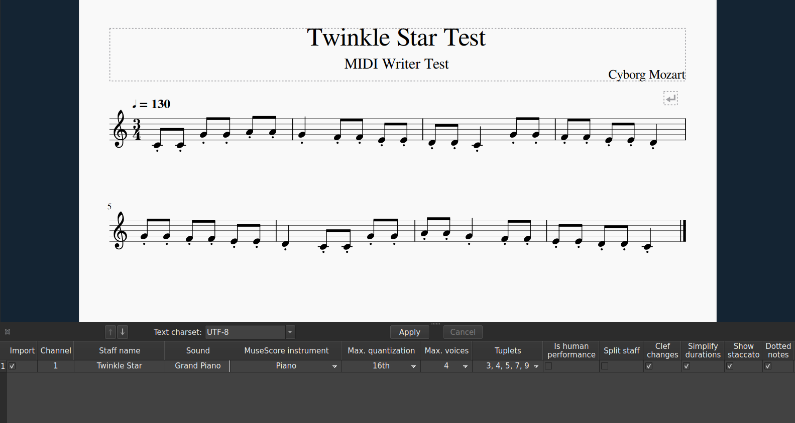

# MidiWriter Python
- lightweight Python module to create MIDI files.

## Overview
- `MidiWriter` is a lightweight Python class designed to generate and save MIDI files.
- It provides an easy-to-use interface for adding tracks, setting channels, specifying tempo, and inserting MIDI note events.

## Features
- add track
- add track name
- add program -> channel mapping
- add note
- add tempo changes
- add time signatures
- `save_as_midi` function to write to MIDI binary file,
- uses MIDI standard of 480 ticks per quarter note.

## Screenshot:


## Installation
1. Clone this repo.
```bash 
git clone https://github.com/logan-a-richey/midi_writer_py.git
```
2. Import and instantiate the MidiWriter class into your program. 
3. Call the `save_as_midi` function. Congrats - you have created a MIDI file!

## Getting started: 
Below is a simple example program for getting started with programatically generating your MIDI files:

```python3
# import my custom midi library
from midi_writer import MidiWriter

# for creating directories and joining path names
import os 

# prevent __pycache__ from being created
import sys 
sys.dont_write_bytecode = True

# specify output file location. create if it doesn't exist
ROOT_DIR = os.getcwd()
OUTPUT_DIR = os.path.join(ROOT_DIR, "midi_outputs")
os.makedirs(OUTPUT_DIR, exist_ok=True)

# simple method demonstrating my MidiWriter utilities.
def simple_example():
    # initialize MidiWriter 
    my_midi_writer = MidiWriter()
    my_midi_writer.add_bpm(start=0, bpm=90) # kwargs makes use case very flexible!
    my_midi_writer.add_time_signature(start=0, numerator=3, denominator=8)
    my_midi_writer.set_channel(channel=0, program=0)
    my_midi_writer.add_track_name(name="C Major Scale")

    # create some notes
    notes = [60, 62, 64, 65, 67, 69, 71, 72]
    for midi_step, pitch in enumerate(notes):
        my_start = MidiWriter.TICKS_PER_QUARTER * midi_step
        my_duration = MidiWriter.TICKS_PER_QUARTER 

        # all variables have good default values    
        # here, I show using all of them
        my_midi_writer.add_note(
            track=0, 
            channel=0,
            start=my_start,
            duration=my_duration, 
            pitch=pitch,
            velcoity=120
        )
    
    # once finished, give your file a location and a name.
    output_file_name = "test_c_major_scale.mid"
    output_file_path = os.path.join(OUTPUT_DIR, output_file_name)

    # run save to write the binary data to your file
    my_midi_writer.save_as_midi(output_file_path)

    # congrats! you have created a MIDI file using Python!

if __name__ == "__main__":
    simple_example()
```

## License
MIT License (MIT)

Copyright (c) 2026 Logan A Richey

Permission is hereby granted, free of charge, to any person obtaining a copy
of this software and associated documentation files (the "Software"), to deal
in the Software without restriction, including without limitation the rights
to use, copy, modify, merge, publish, distribute, sublicense, and/or sell
copies of the Software, and to permit persons to whom the Software is
furnished to do so, subject to the following conditions:

The above copyright notice and this permission notice shall be included in
all copies or substantial portions of the Software.

THE SOFTWARE IS PROVIDED "AS IS", WITHOUT WARRANTY OF ANY KIND, EXPRESS OR
IMPLIED, INCLUDING BUT NOT LIMITED TO THE WARRANTIES OF MERCHANTABILITY,
FITNESS FOR A PARTICULAR PURPOSE AND NONINFRINGEMENT. IN NO EVENT SHALL THE
AUTHORS OR COPYRIGHT HOLDERS BE LIABLE FOR ANY CLAIM, DAMAGES OR OTHER
LIABILITY, WHETHER IN AN ACTION OF CONTRACT, TORT OR OTHERWISE, ARISING FROM,
OUT OF OR IN CONNECTION WITH THE SOFTWARE OR THE USE OR OTHER DEALINGS IN
THE SOFTWARE.
